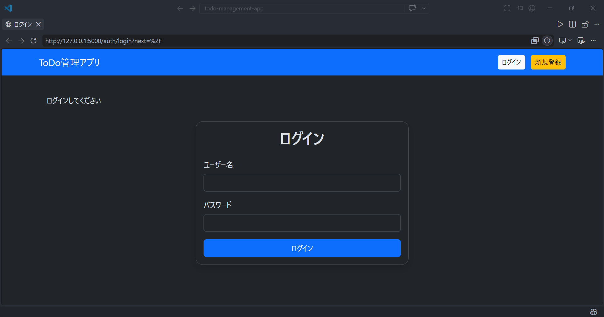
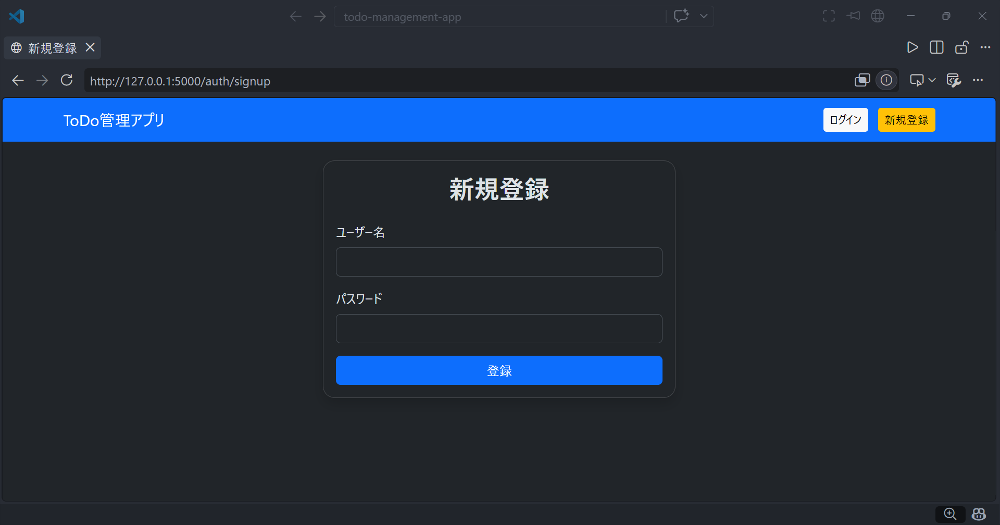
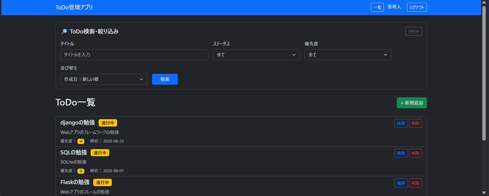
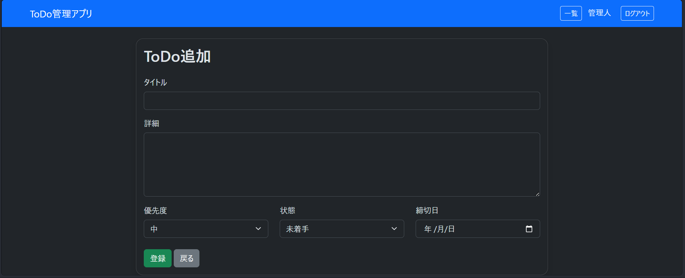
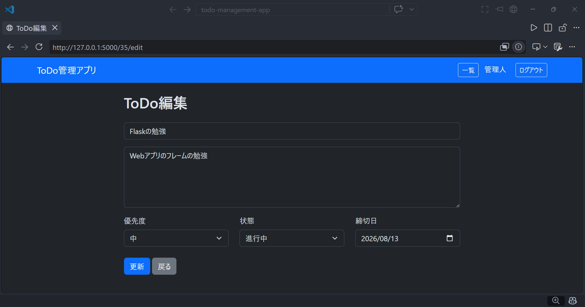

# ToDo管理アプリ

FlaskとSQLiteを使って作成した、ログイン機能付きのToDo管理アプリです。

Python・Flask・データベース・CRUD・Blueprint・Flask-WTF・Gitなどの基本的なWebアプリ開発を学習することを目的として作成しました。

## 📌 主な機能

* ユーザー登録
* ログイン・ログアウト
* ToDoの登録
* ToDo一覧表示
* ToDoの編集
* ToDoの削除
* ToDoのステータス管理
* ToDoの優先度管理
* 期限の設定
* ToDoのページネーション
* フォーム入力のバリデーション
* CSRF対策
* ユーザーごとのToDo管理

## 🖥 スクリーンショット

### ログイン画面



### ユーザー登録画面



### ToDo一覧



### ToDo追加画面



### ToDo編集画面



## 🛠 使用技術

| 技術           | 内容                 |
| ------------ | ------------------ |
| Python       | 3.x                |
| Flask        | Webアプリケーションフレームワーク |
| SQLite       | データベース             |
| Flask-Login  | ログイン・認証管理          |
| Flask-WTF    | フォーム・CSRF対策        |
| WTForms      | フォームバリデーション        |
| Bootstrap    | 画面デザイン             |
| Werkzeug     | パスワードのハッシュ化        |
| Git / GitHub | バージョン管理            |

## 📂 プロジェクト構成

todo-management-app/
│
├── app.py                  # Flaskアプリの起動
├── config.py               # アプリの設定
├── database.py             # データベース接続
├── form.py                 # フォーム定義
├── init_db.py              # データベース初期化
├── models.py               # データベースモデル
│
├── README.md               # プロジェクト説明
├── .gitignore              # Git管理から除外するファイル
├── pyproject.toml          # Pythonプロジェクト設定
├── requirement.txt         # 必要なライブラリ
│
├── screenshots/            # README用スクリーンショット
│   ├── login.png           # ログイン画面
│   ├── register.png        # ユーザー登録画面
│   ├── todo_list.png       # ToDo一覧画面
│   ├── todo_add.png        # ToDo追加画面
│   └── todo_edit.png       # ToDo編集画面
│
├── blueprints/             # Flask Blueprint
│   ├── auth.py             # 認証関連
│   └── todo.py             # ToDo関連
│
├── templates/              # HTMLテンプレート
│   ├── base.html           # 共通レイアウト
│   ├── login.html          # ログイン画面
│   ├── signup.html         # ユーザー登録画面
│   ├── todo_list.html      # ToDo一覧画面
│   ├── todo_add.html       # ToDo追加画面
│   └── todo_edit.html      # ToDo編集画面
│
└── static/
    └── css/
        └── style.css       # CSS
```

## 🗄 データベース

SQLiteを使用しています。

### usersテーブル

```sql
CREATE TABLE users (
    id INTEGER PRIMARY KEY AUTOINCREMENT,
    username TEXT NOT NULL UNIQUE,
    password TEXT NOT NULL
);
```

### todosテーブル

```sql
CREATE TABLE todos (
    id INTEGER PRIMARY KEY AUTOINCREMENT,
    user_id INTEGER NOT NULL,
    title TEXT NOT NULL,
    description TEXT,
    status TEXT NOT NULL DEFAULT "未着手",
    priority TEXT NOT NULL DEFAULT "中",
    deadline TEXT,
    created_at TEXT NOT NULL,
    updated_at TEXT NOT NULL,
    FOREIGN KEY (user_id) REFERENCES users (id)
);
```

## 🚀 セットアップ

### 1. リポジトリをクローン

```bash
git clone https://github.com/chatora0330/todo-management-app.git
cd todo-management-app
```

### 2. 仮想環境を作成

Windowsの場合：

```bash
python -m venv venv
```

### 3. 仮想環境を有効化

```bash
venv\Scripts\activate
```

### 4. 必要なライブラリをインストール

```bash
pip install -r requirements.txt
```

### 5. SECRET_KEYを設定

環境変数にSECRET_KEYを設定します。

Windows PowerShellの場合：

```powershell
$env:SECRET_KEY="任意の秘密の文字列"
```

### 6. アプリを起動

```bash
python app.py
```

ブラウザで以下にアクセスします。

```text
http://127.0.0.1:5000/
```

## 🔐 セキュリティ

このアプリでは、以下の対策を行っています。

* パスワードをハッシュ化して保存
* Flask-Loginによるログイン管理
* Flask-WTFによるCSRF対策
* SECRET_KEYを環境変数で管理
* ログインユーザーごとにToDoを管理

パスワードは平文ではデータベースに保存せず、Werkzeugの`generate_password_hash()`を使用してハッシュ化しています。

## 📝 ToDoのステータス

ToDoには以下のステータスを設定できます。

* 未着手
* 進行中
* 完了

## ⭐ 優先度

ToDoには優先度を設定できます。

* 高
* 中
* 低

## 📅 期限

ToDoごとに期限を設定できます。

期限を設定することで、いつまでに対応する必要があるToDoなのかを管理できます。

## 📄 バリデーション

フォームには入力チェックを実装しています。

### タイトル

* 必須
* 100文字以内

### 詳細

* 1000文字以内

入力内容に問題がある場合は、日本語のエラーメッセージを表示します。

## 📖 学習したこと

このアプリの制作を通して、以下の内容を学習しました。

* Flaskの基本
* Flaskのルーティング
* Blueprint
* SQLite
* SQL
* CRUD処理
* ユーザー認証
* Flask-Login
* パスワードのハッシュ化
* Flask-WTF
* WTForms
* CSRF対策
* バリデーション
* ページネーション
* Jinja2テンプレート
* Bootstrap
* 環境変数
* Git
* Gitブランチ

## 🌱 今後追加したい機能

今後、以下の機能追加を予定しています。

* [ ] ToDoの検索機能
* [ ] ステータスによる絞り込み
* [ ] 優先度による並び替え
* [ ] 期限切れToDoの表示
* [ ] 完了したToDoの表示切り替え
* [ ] ユーザープロフィール
* [ ] パスワード変更
* [ ] テストコードの追加
* [ ] デプロイ

## 🎯 制作目的

Python未経験からWebアプリケーション開発を学習するために制作しました。

Flaskを使ったWebアプリの基本的な構造を理解し、データベース操作、ユーザー認証、フォーム処理、Gitによるバージョン管理など、Web開発に必要な基礎知識を実際にコードを書きながら学習しています。

## 📜 License

This project is for learning purposes.
